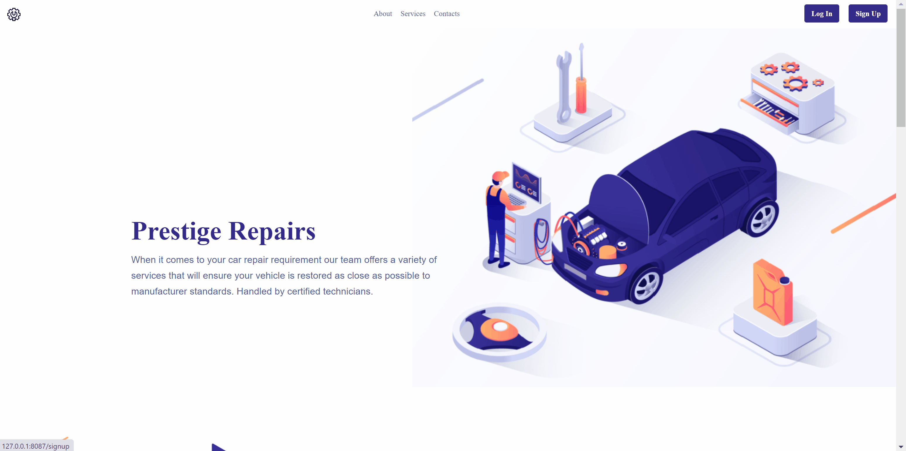
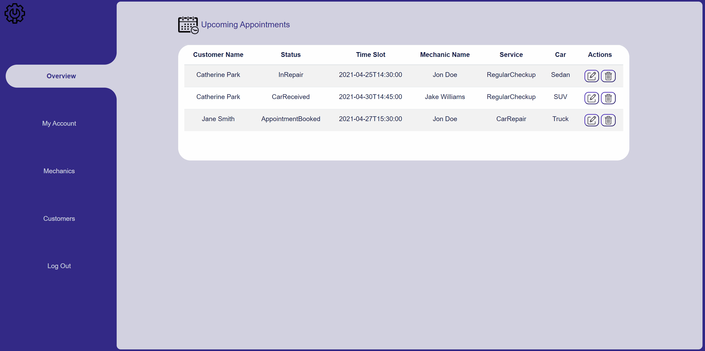
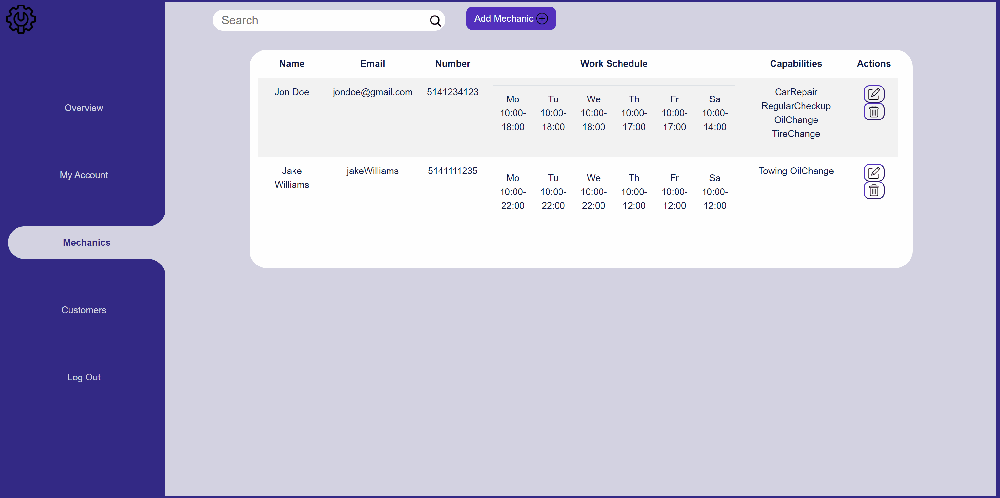
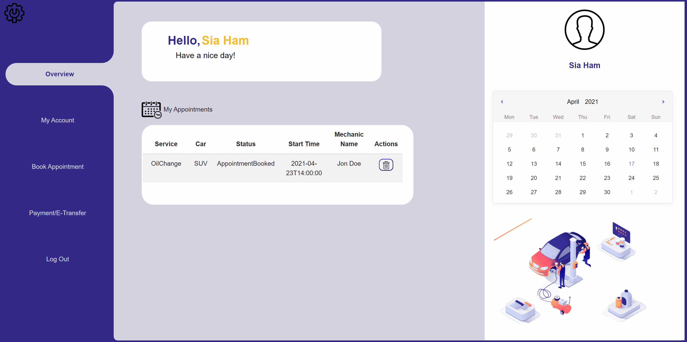
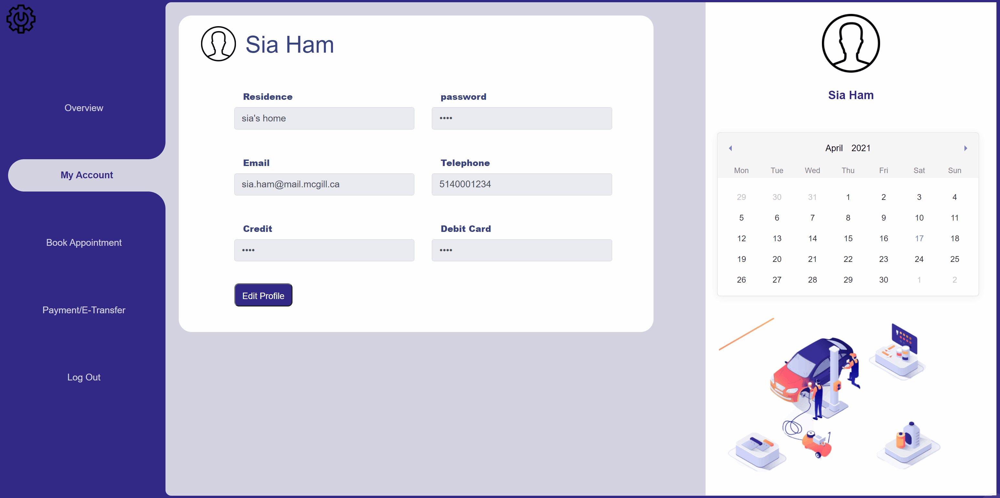
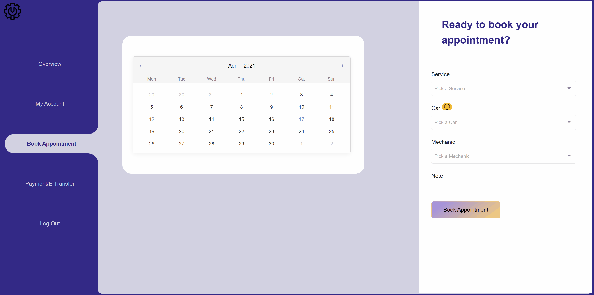
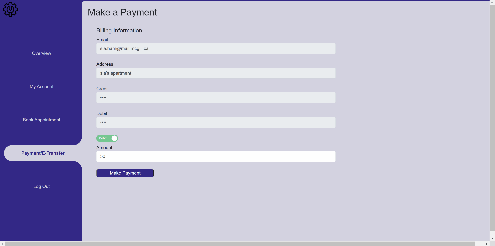

### Project Description
The project aims to develop an interactive and functional web and android application for a local automobile repair shop. The application will allow customers to
have access and book a variety of services (towing, oil change, tire changes, regular maintenance, car repairs etc.) which are offered by qualified technicians working at the company. The technicians will be able to view their upcoming appointments and the administrator's assistant will be able to moderate, manage the shop's appointments and technicnan work schedule through the platform. This project is a part of ECSE321 project.

# Web Application
### Landing Page

### Sign Up Page 
- Customer can sign up on this page. Mechanic’s account can only be created by admin.

## User as Administrator 
### Admin Dashboard Page
Once admin logs in, they are navigated to admin dashboard page.
They can do the followings:
- View upcoming appointments
- Delete an appointment
- Edit appointment status

### Mechanic Management Page
In this page admin can do the followings
- View mechanics
- Edit mechanic info
- Add new mechanic
- Delete mechanic
- Search mechanic by name

### Customer Management Page
In this page admin can do the followings
- View customers
- Edit customer info
- Add car to a customer
- Book appointment to a customer (this change is reflected on both admin and customer dashboard page)
- Add new customer
- Search customer by name
- Delete customer

## User as Customer 
### Customer Dashboard Page
Once a customer logs in, the customer is navigated to customer dashboard page.
They can do the followings:
- View upcoming appointments
- Delete an appointment

### Edit Profile Page
In this page customer can edit their information

### Book Appointment Page
In this page customer can do the followings:
- select date
- select time
- select service
- add a car
- select car
- select mechanic
- add notes
- book appointment (this change is reflected on both customer and admin dashboard page)

### Make Payment Page
In this page customer information is automatically filled up in each section and the customer can make payment

### User as Mechanic

# Mobile Application

### Mobile Application
### Team Members
- Annabelle Dion
- Sia Ham
- Thomas Jarvis
- Norman Kong
- Catherine Van Gheluwe 

## Documentation
 - [Requirement Model](https://github.com/McGill-ECSE321-Winter2021/project-group-07/wiki/Requirements-Model-(requirements-&-use-case))
 - [Domain Model](https://github.com/McGill-ECSE321-Winter2021/project-group-07/wiki/Domain-Model-Iterations)
 - [RESTful Service Endpoints](https://github.com/McGill-ECSE321-Winter2021/project-group-07/wiki/RESTful-Service-Endpoints)
 - [Software Quality Assurance Plan and Report](https://github.com/McGill-ECSE321-Winter2021/project-group-07/wiki/Software-Quality-Assurance-Plan-and-Report)
 - [Architecture Model - Block Diagram](https://github.com/McGill-ECSE321-Winter2021/project-group-07/wiki/Architecture-Model)
 - [Figma](https://www.figma.com/file/WGQveChTZA6qFVNFDvxh8g/Untitled?node-id=0%3A1)
 - [User Documentation](https://github.com/McGill-ECSE321-Winter2021/project-group-07/wiki/User-Documentation)

